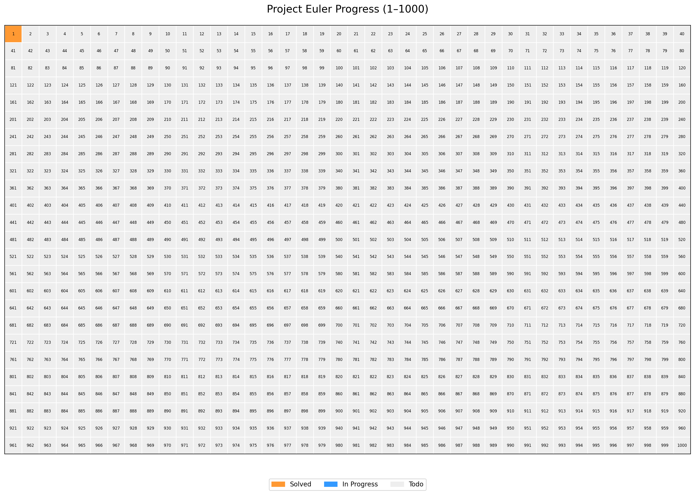

# 📚 Project Euler Mathematical Compendium

  
  
  

---

## 🧮 Mục tiêu
Kho lưu trữ toàn diện các lời giải **Project Euler**, kết hợp:
- Giải pháp bằng code
- Phân tích toán học bằng LaTeX
- Biểu đồ trực quan tiến độ

---

## 📊 Tiến trình
<!-- PROGRESS_TABLE_START -->
| # | Title | Difficulty | Language | Status |
|---|--------|------------|----------|--------|
| [1](https://projecteuler.net/problem=1) | Multiples of 3 and 5 | Easy | python | ✅ |
| [2](https://projecteuler.net/problem=2) | Even Fibonacci numbers | Easy |  | ⬜ |
| [3](https://projecteuler.net/problem=3) | Largest prime factor | Medium |  | ⬜ |
<!-- PROGRESS_TABLE_END -->

---

## 🗺️ Heatmap

---

## 🔗 Links
- [Project Euler Website](https://projecteuler.net/archives)
# ?? Project Euler Mathematical Compendium 
